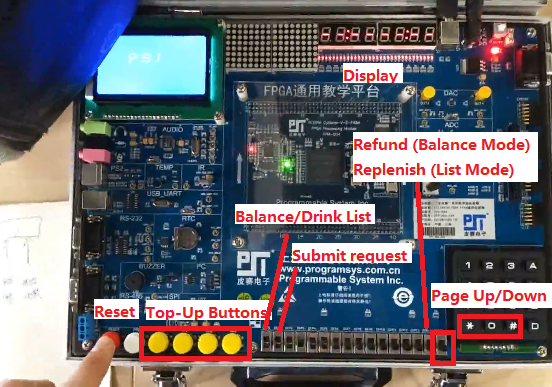
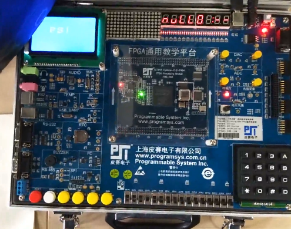
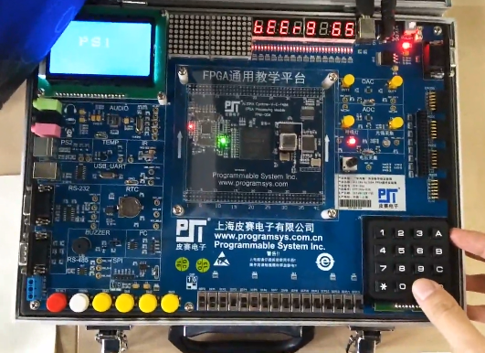
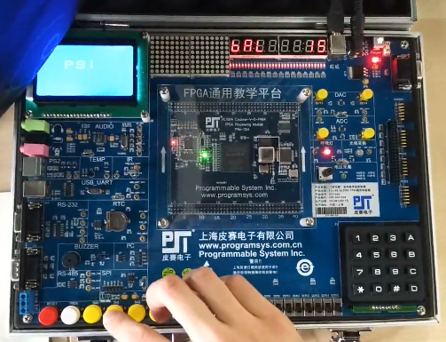
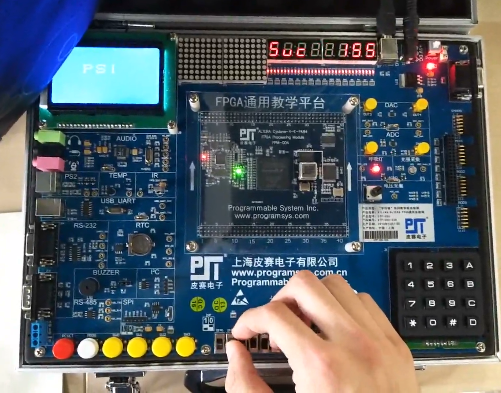
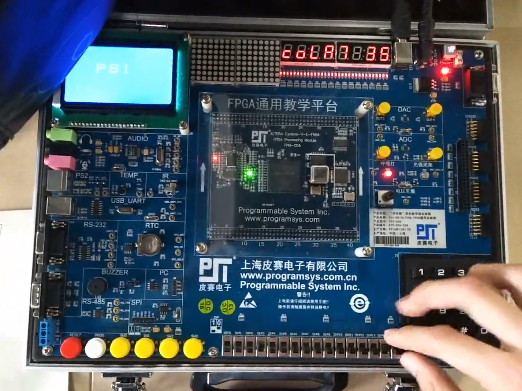

# Electronic-Design-of-A-Vending-Machine

This course project was conducted in Fundamentals of Electronic System Design course. The hardware platform of the experiments was Altera Cyclone V FPGA, 5CEFA2F23C8N.

## Design Requirements

The intention of my project is to use VHDL to implement the behavior of a common vending machine on an FPGA platform. This design has the functions below:

1. Display the names of drinks.

2. When a certain type of drinks is chosen, the name, the price and the amount of remaining drinks are all displayed on the screen.

3. In top-up mode, only the coins of one dollar, half a dollar, five dollars and ten dollars can be accepted.

4. When a purchasing request is submitted, the vending machine checks whether this request is valid according to the price of the chosen drink, the balance of the user account and the amount of remaining drinks. If the request is valid, the machine will return a "success" message combined with the current balance of the user account; otherwise, it throws a "failure" signal.

5. Drinks can be replenished by the administrator.

## Features

* Modular design: a clear structure.

_I divided the whole design into several sub-parts, namely sales module (interfaces), state management module, good management module, balance management module and displaying module.  Each module can be designed and tested separately. When they are all ready, they can be easily put together if only they follows the pre-established protocols._

* A centralized state manager: good for synchronization.

_The design adopts a model of finite-state machine. Because of the isolation of each module, making them working corresponding with a mutual clock signal becomes a challenge. To settle down this problem, I set a global state manager in the circuit, which takes the responsibility of switching the states according to the inputted signal, and correspondingly provide each module with correct state signal. By separating the state management part from single modules, the circuit converts the state into a global input, which ensures the same value of state for each module at every moment._

## Testing and Results

### Buttons

### Reset

After plugging in, the reset button should be pressed to ensure the circuit works as expected. When the vending machine is reset, the balance is set as 0 and all the drinks are replenished.

 

Release the button. Then the seven-segment display array shows the first entry of the drink list: "null 0:--"

### Page Up/Down

"*" and "#" are the page up/down button. Users can switch the type of drink display on the seven-segment led array. In the photo above, the name of the drink is "beer". The amount of remaining beer is "9". The price of each (bottle of) beer is 6.5 dollars (digital point is missing because of the platform limitation).

### Top-up

Users can add some fund to their account in either list mode or balance mode, but the balance will only be shown under balance mode.

### Buying

The user can submit a buying request under drink list mode or balance mode to buy one bottle of drinks on which the pointer of drink list is. The vending machine makes its judgment, and return the request state ("success" or "failure") and the balance on the user's account.

### After Buying

After a deal was made, the amount of remaining drinks changed  correspondingly.

[_More details? See the demo video._](./pics/video.mp4)

